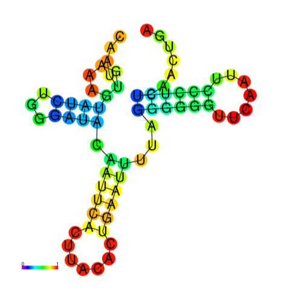
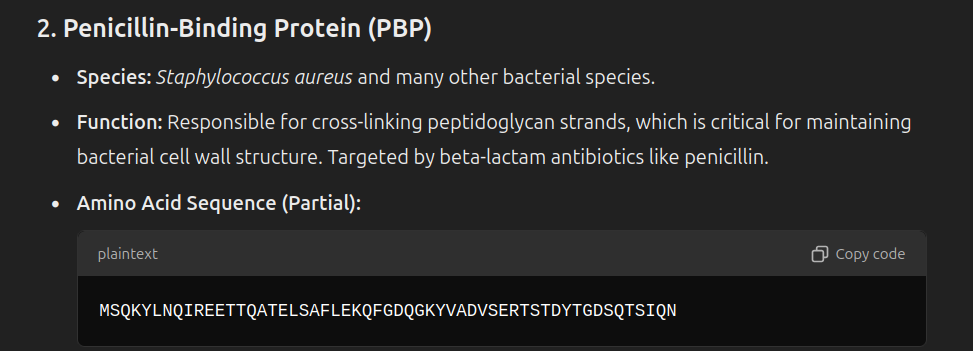
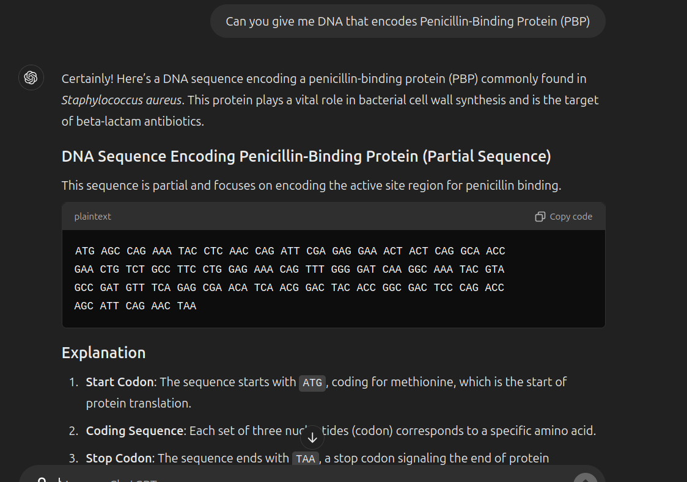
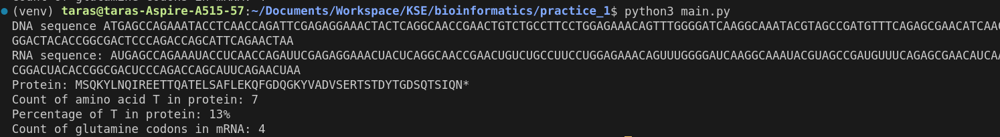

# Resources and Structure

1.  tRNA-Val [ Struwela camposi ]
    https://www.ncbi.nlm.nih.gov/nuccore/NC_087882.1?report=fasta&from=5315&to=5384

FASTA:

> NC_087882.1:5315-5384 Struwela camposi voucher SIO:BIC:A13437 mitochondrion, complete genome
> CAATTGAAAGTATCTGGGATACAATTCACTTACACTGAATTTTAGGGGGGTTCAATTCCCTCTCAACTGA

2. Penicillin-Binding Protein (PBP)

2-5. Look in main.py file

Expected output of main.py file for tasks 2-5

# Summarizing

In this practice I have learnt how to get DNA sequence of particular tRNA in FASTA format using [NBCI]('https://www.ncbi.nlm.nih.gov/') website. I have learnt how to use python library [biopyhton]('https://biopython.org/') to analyze Bio sequences. Thanks Chat GPT I found what capital letters in proteins sequences mean 😀 (for example T stands for Threonine in shorten Thr).
